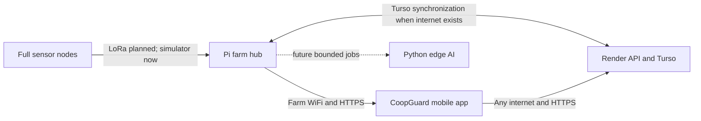
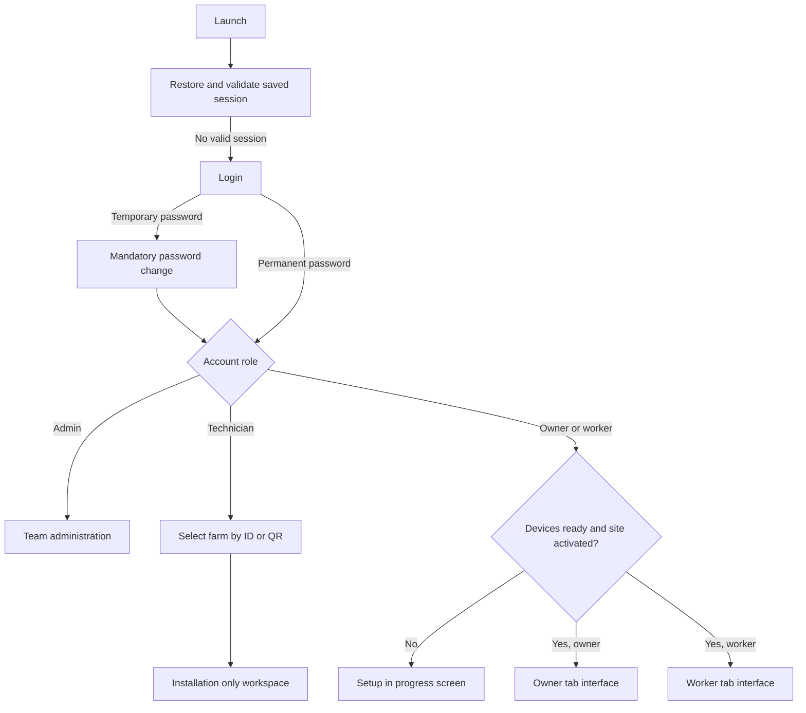

# CoopGuard Mobile App: Functional and Technical Design Handoff

**Document status:** Current implementation contract
**Reviewed against:** Mobile app `0.7.1`, backend `0.7.0`
**Review date:** 2026-10-07
**Audience:** Figma designers, UI design agents, mobile developers, backend developers, and pilot reviewers

## 1. Purpose and design boundary

This document describes the CoopGuard app that exists in the current source code. A redesign may change **colors, typography, spacing, component appearance, illustration, icon style, motion, and layout style**. It must preserve:

- every role and permission;
- every required step, gate, status, and validation rule;
- the distinction between sample readings, saved telemetry, and live telemetry;
- the distinction between cloud, farm hub, and offline use;
- every conditional feature determined by the technician survey;
- every safety restriction around equipment control;
- the meaning and result of every user action;
- all loading, empty, error, disabled, pending, completed, and offline states;
- the separation between implemented, simulated, and future functionality.

The redesign must not expose operational farm data to the technician setup flow, let owners edit technician records, let workers manage the farm, skip commissioning stages, imply that simulated equipment is physically connected, or present unfinished AI as a working prediction.

## 2. Product definition

CoopGuard is an offline capable poultry house monitoring app. It connects phones to a farm hub over farm WiFi and to a shared cloud backend over any internet connection. Sensor nodes communicate with the hub through LoRa; phones do not communicate directly with nodes through LoRa.

The app supports four personas:

1. **Team administrator:** registers a farm and creates its first owner account.
2. **CoopGuard technician:** selects a farm, surveys it, prepares and verifies its installation, and activates the approved operating mode.
3. **Farm owner:** monitors an activated house, manages flock cycles, and manages worker accounts.
4. **Farm worker:** performs daily monitoring, acknowledges local alerts, and records observations.

The current app uses simulated hub and node provisioning so the full installation flow can be tested before physical hardware is available. Authenticated telemetry ingestion is implemented and can replace sample readings when the JavaScript gateway simulator sends data. Physical LoRa transport, real actuator feedback, push delivery, and trained AI models are not yet implemented.

## 3. Current implementation status

| Capability | Current status | Required presentation |
| --- | --- | --- |
| Username/password accounts | Implemented | Real account flow |
| Admin, technician, owner, and worker roles | Implemented | Role specific interfaces |
| Farm ID and Farm QR selection | Implemented | Farm selection only; QR is not authentication |
| Site survey and generated plan | Implemented | Real stored workflow |
| Hub and node QR pairing | Implemented as simulation | Always identify as simulated until physical provisioning replaces it |
| Five environmental readings per standard node | Implemented with sample or authenticated telemetry data | Show source and freshness |
| Telemetry history | Implemented | Whole house aggregation of stored node history |
| In-app alerts | Implemented | Preserve severity, state, source time, and local acknowledgement rule |
| Equipment control | Simulated | Never imply that a fan or other device physically changed |
| Environmental AI | Data collection state only | No prediction result exists yet |
| Sound anomaly AI | Coming soon; model not trained | Never show diagnosis or working inference |
| Inspection notes and offline note queue | Implemented | Show pending synchronization state |
| Cloud and paired hub selection | Implemented | Show active source and fallback state |
| Phone cache | Implemented | Clearly label saved or stale data |
| SMS/GSM alerts | Removed | Do not design SMS controls or contact lists |
| OS push notifications | Not implemented in the current app | Do not imply that remote push delivery is available |
| Physical LoRa and actuator integration | Not implemented | Keep outside current operational claims |

## 4. System model

### 4.1 Technology stack

| Layer | Current technology |
| --- | --- |
| Mobile | React Native 0.86, Expo 57, React 19, TypeScript, React Navigation |
| Supported app targets | Android and iOS; portrait orientation; Android is the current test target |
| Mobile persistence | Expo SecureStore for session records; AsyncStorage for hub profiles, farm caches, survey drafts, and offline outbox records |
| Backend | Node.js 24, TypeScript, Fastify 5, Zod validation |
| Cloud database | Turso/libSQL |
| Hub database | Local Turso Sync replica with cloud push/pull |
| Local development database | SQLite with foreign keys, WAL, and serialized mutations |
| AI | Python on the Pi hub, planned and isolated from CRUD/control; no trained model is connected |
| Gateway simulator | JavaScript, authenticated HTTP telemetry, local retry spool |

### 4.2 Network behavior

- **Farm hub mode:** the app uses a paired private or `.local` HTTPS address and labels the connection as farm WiFi/local.
- **Cloud mode:** the app uses the Render HTTPS endpoint over WiFi or mobile data.
- **Offline mode:** the app displays the last validated farm cache. It does not claim that saved values are live.
- When both endpoints are reachable, the app prefers the paired hub.
- Account identity and farm records are shared through the synchronized database; local and cloud do not use separate user accounts.
- The authentication connection is checked when the app becomes active and every 45 seconds. Farm data is refreshed when the app becomes active and every 20 seconds while active.

## 5. Account and permission model

There is no public registration, role selector, or self assigned role.

| Role | Created by | Farm access | Main authority | Prohibited access |
| --- | --- | --- | --- | --- |
| Administrator | Private CoopGuard operator process | Global administration; no farm membership required | Register a farm and create its owner | Operational farm dashboard, survey, devices, worker tasks |
| Technician | CoopGuard team; one reusable technician account may serve many farms | Any registered farm selected by exact Farm ID or Farm QR | Survey, plan approval, device setup, checklists, commissioning, trial, activation, calibration, diagnostics | Owner/worker operational dashboard, alerts, heat map, analytics, flock management, worker account management |
| Owner | Administrator during farm registration | Explicitly assigned farm | Operational monitoring, flock cycles, worker accounts, worker password resets | Editing technician survey, plan, installation, or commissioning records |
| Worker | Owner of that farm | Explicitly assigned farm | Daily monitoring and personal inspection observations | Account administration, flock cycles, site workflow, devices, farm setup |

### 5.1 Credentials and sessions

- Usernames are normalized to lowercase and accept 3 to 40 letters, numbers, dots, underscores, or hyphens.
- Passwords are 12 to 128 characters.
- New admin, owner, technician, and worker credentials use a temporary password.
- A temporary password forces the password change screen before any role workspace opens.
- Password change requires the current password, a new password, and confirmation.
- Changing or resetting a password revokes existing sessions.
- Disabling a worker revokes that worker's sessions.
- Session tokens expire after seven days and are stored in SecureStore; passwords are never stored in the app.
- When both servers are unreachable, a validated saved session may reopen the app for up to 24 hours after the last successful identity check, while still inside the seven day session lifetime.
- Forgotten worker credentials are handled by the owner. Owner and technician recovery is handled by the CoopGuard team.

## 6. Global application routing

### 6.1 Sign in screen

Required elements and states:

- username field;
- password field;
- sign in button;
- busy and server error states;
- explanation that credentials come from the owner or CoopGuard team;
- explanation that cloud works through any internet connection and that the paired hub is selected automatically on farm WiFi;
- mandatory password change form when `mustChangePassword` is true;
- current password, new password, confirm password, validation, and completion states.

### 6.2 Owner and worker activation gate

Until the installation is both device ready and activated, owners and workers see only a **Setup in progress** screen plus the Account sheet. Operational tabs remain unavailable.

The screen shows the farm name, Farm ID, and four progress items:

1. Technician survey completed.
2. Farm hub paired and reporting.
3. The planned number of nodes paired and reporting.
4. Installation commissioned and activated.

The message states that monitoring, trends, alerts, and equipment functions appear after the technician completes the process.

## 7. Administrator experience

The administrator has one workspace and no bottom navigation.

### 7.1 Register a farm

All fields are required in the current mobile form:

- Farm name
- Customer name
- Contact person
- Contact number
- Farm address
- Owner full name
- Owner username

The create action is disabled without a server connection. Success produces:

- generated Farm ID in the `CG-...` format;
- internal farm record ID;
- Farm setup QR;
- owner name and username;
- one time temporary owner password;
- Share setup credentials action;
- Create another farm action.

The temporary password is displayed once and must be delivered privately. The owner changes it at first sign in. The shared technician is not recreated for every farm.

## 8. Technician experience

The technician does not receive the operational bottom tabs.

### 8.1 Select the farm for a visit

The initial technician screen contains:

- Farm ID input;
- Open farm setup action;
- Scan Farm QR action;
- camera permission and scanner states;
- signed in technician identity;
- sign out action;
- errors for invalid, unknown, or unreachable farms.

The Farm QR identifies the farm only. The signed in technician session grants access. The selector does not load or display readings.

### 8.2 Technician setup workspace

After a farm is selected, the header shows:

- `TECHNICIAN SETUP` context;
- farm name and Farm ID;
- setup synchronization state;
- Account action.

The screen must state that it contains installation records only and that farm readings, operational alerts, and the house map are hidden.

The main workspace shows either the site workflow, the survey form, or one selected technician tool. Pull to refresh remains available.

### 8.3 Site workflow state machine

```mermaid
stateDiagram-v2
    [*] --> SurveyRequired
    SurveyRequired --> TechnicalReview: Complete survey
    TechnicalReview --> ApprovedInstallation: Approve plan; no blockers
    ApprovedInstallation --> Installing: Start installation
    Installing --> Commissioning: Installation checks pass and planned devices report
    Commissioning --> MonitoringTrial: Commissioning checks pass
    MonitoringTrial --> NormalMonitor: Trial checks pass; activate monitor only
    MonitoringTrial --> NormalControl: Trial checks pass; plan is full control candidate
```

Changing the survey generates a new plan and returns the workflow to technical review. A survey never activates control by itself.

## 9. Technician site survey

The survey uses five pages. Answers are selections or checkboxes; the current workflow does not ask the technician to write narrative incident history. A draft is saved on the phone for the selected account and farm.

### 9.1 Page 1: House and layout

| Question | Choices / behavior |
| --- | --- |
| House type | Open sided; Closed/tunnel; Mixed; Verify on site |
| Measured house length | Not measured; 8, 12, 16, 20, 30, 60, 90, or 120 m |
| Measured house width | Same values as length |
| Flock type for environmental targets | Broiler; Layer; Breeder; Other; Not selected |
| Temperature and ventilation targets by flock age are available | Yes; No; Unknown |
| Main airflow layout | Side openings/curtains; End to end tunnel flow; Mixed openings; Needs placement review |
| Known hot, cold, or poorly ventilated area | Yes; No; Unknown |
| Leaks, wet areas, or condensation can reach hardware | Yes; No; Unknown |
| Mounting and maintenance access | Dry/easy; Limited; Washdown/heavy dust; Needs placement review |

Farm identity, main house name, owner identity, technician identity, visit date, and Philippines radio region are initialized from the selected account/farm and form defaults.

### 9.2 Page 2: Equipment and control

1. Record whether an existing automatic controller is present, absent, or must be verified.
2. If it is not confirmed absent, record whether it works and must remain in service.
3. Add zero or more equipment groups.

Each equipment group records:

| Field | Choices |
| --- | --- |
| Type | Fans; Heaters; Lights; Cooling pads; Curtain motors; Water pumps; Other |
| Quantity | 1, 2, 3, 4, 6, 8, 10, or 12 |
| Location | Inlet end; Center; Fan/exhaust end; Side wall; Service area |
| Nameplate/model photographed | Yes; No; Unknown |
| Verified electrical supply | 230 V single phase; 400 V three phase; Other verified; Not verified |
| Current control method | Manual; Automatic; Both; Unknown |
| Observed condition | Working; Damaged; Intermittent; Not tested |
| Control interface | On/off; Multiple stages; Variable speed; Needs electrical review |
| Panel and circuit identified | Yes; No; Unknown |
| Powered by backup supply | Yes; No; Unknown |
| Request CoopGuard automatic control | Checkbox |
| Safe state after control/communication failure | Conditional on control request: return to manual; remain on; remain off; return to existing controller; needs safety review |

An equipment group may be removed. A house with no supported equipment can still receive monitoring.

### 9.3 Page 3: Hub, power, and network

| Question | Choices |
| --- | --- |
| Mains power reliability | Reliable; Frequent outages; Unknown |
| Generator, battery, or backup exists | Yes; No; Unknown |
| Backup transfer method | Conditional: automatic transfer; manual generator start; battery/UPS only; needs verification |
| Hub power source | Protected service room; control panel supply; protected house outlet; new dedicated circuit; no safe source confirmed |
| Internet service available | Yes; No; Unknown |
| Farm WiFi available | Yes; No; Unknown |
| Safe hub location | Service room; control room; protected house wall; no safe location yet |
| LoRa antenna position | High/clear in house; protected external mast; inside service room; coverage test required |
| Radio obstruction | Low; metal walls/partitions; multiple buildings; coverage test required |
| Local app access area | Inside house; house and service area; across farm |
| LoRa region | Philippines |

Internet availability changes the generated plan between cloud synchronization and local only operation. It does not disable local monitoring.

### 9.4 Page 4: Nodes and sensors

| Question | Choices / behavior |
| --- | --- |
| Planned node count | 1, 2, 3, 4, 6, 8, 10, or 12 |
| Environmental sensors | Fixed on every node: temperature, humidity, ammonia, carbon dioxide, litter moisture |
| Microphone/unusual sound collection | Optional checkbox |
| Placement pattern | Inlet/center/exhaust; two opposite zones; single center; set after LoRa coverage test |

If sound collection is enabled, also record:

- owner consent: Yes, No, Unknown;
- microphone position: center, two zones, away from fans/feeders, or after noise test;
- primary background noise: fans, feeders, road, mixed, or low;
- observation recorder: owner, assigned worker, or technician.

Every standard sensor node has the full five sensor set. The technician selects node count and section placement; the interface must not present the five environmental sensors as mutually exclusive node profiles.

### 9.5 Page 5: Safety and review

| Question | Choices / behavior |
| --- | --- |
| Primary alert responder | Owner; assigned worker; owner and worker |
| After hours responder | Same responder; owner; assigned worker |
| Expected response time | 5, 10, 15, 30, or 60 minutes |
| Authorized manual equipment operators | Conditional when equipment exists: owner; trained workers; both |
| Immediate action after mains power loss | Start generator and inspect; inspect/use manual ventilation; call owner/responder; no verified plan |
| Visible wiring condition | No visible damage; damaged/unsafe; electrical review required |
| Water can reach hardware/wiring | Yes; No; Unknown |
| Installation hazards | None observed; height/access; wet area; damaged wiring; multiple hazards |
| Electrical control assessment | Conditional when control is requested: approved; still required; monitor only; not verified |
| Installation photo permission | Yes; No; Unknown |
| Requested operating mode | Monitor only; request control when equipment requests it; decide after review |

When photo permission is yes, evidence checkboxes cover exterior/dimensions, interior/airflow, controller/equipment, panels/nameplates, power/backup, hub/antenna/node locations, and hazards/wet areas.

The final page previews the functions generated for this house and requires:

- owner reviewed the recorded findings;
- technician confirms survey accuracy.

Completion also requires farm name, house name, owner/contact, nonzero dimensions, hub power source, safe hub location, Philippines radio region, at least one node, a placement pattern, primary responder, a verified power loss response, owner acknowledgement, and technician confirmation.

### 9.6 Generated plan rules

The plan contains recommended mode, number of house sections, node count, enabled measurements, equipment groups, connection mode, blockers, and control restrictions.

- Sections = the larger house dimension divided into approximately 30 m spans, rounded up, with a minimum of one.
- The five environmental measurements are always enabled.
- Sound collection is included only when a microphone is selected and consent is yes.
- Internet yes produces `cloud_sync`; otherwise the plan is `local_only`.
- Visible damaged wiring, no safe hub location, no confirmed hub power, or zero nodes blocks plan approval.
- Mixed/unknown house type, any present/unknown third party controller, no approved control equipment, incomplete equipment/fallback details, incomplete required evidence, unapproved electrical interface, unverified wiring, tunnel house without backup power, or monitor/undecided preference restricts the plan to monitor only.
- A plan is a full control candidate only when there are no control restrictions.
- A full control candidate still remains locked until installation, commissioning, and the monitoring trial are complete.

## 10. Simulated hub and node provisioning

This section appears after a survey and plan exist.

### 10.1 Farm target QR

- Displays the selected Farm ID and a Farm QR.
- URI shape: `coopguard://farm/open?version=1&farm=<Farm-ID>`.
- The QR selects the farm; it contains no login credentials.

### 10.2 Hub flow

1. Create hub QR.
2. Display generated `HUB-...` identity and pairing QR.
3. Confirm the device on the same phone, or scan it from print/another screen.
4. Mark the hub reporting.
5. Enable node creation.

The simulated pairing QR includes schema version, device kind, Farm ID, device ID, and pairing code. It contains no account password. A hub can be removed before activation; removing it resets its simulated nodes.

### 10.3 Node flow

1. Select Section A, B, or C.
2. Create a sensor node QR.
3. Display generated `NODE-...` identity and pairing QR.
4. Confirm or scan it.
5. Mark it reporting through the selected farm's hub.

Every node is labeled **Full sensor set**. Device readiness requires one reporting hub and at least the plan's required number of reporting nodes. Devices can be removed before activation.

### 10.4 Real hub address pairing

The technician Account sheet can pair a commissioned hub by an HTTPS root address. The app verifies that `/health` identifies a CoopGuard service in hub mode with a hub ID. The saved address is associated with the farm on the phone. Owners and workers do not enter server addresses. The same account token is used with cloud and hub.

## 11. Installation, commissioning, trial, and activation

### 11.1 Installation checklist

All required items must pass. Equipment wiring can be N/A only for a monitor only plan.

- Hub mounted at approved location
- LoRa antenna installed and protected
- All planned nodes mounted
- Node IDs match planned locations
- Hub and node power sources verified
- Approved equipment wiring completed
- Differences from plan recorded

Commissioning cannot start until this checklist passes and the planned simulated hub/nodes are reporting.

### 11.2 Commissioning checklist

- Every installed node reports
- LoRa coverage passes at every location
- Local WiFi works where staff use the app
- Readings were compared and are plausible
- Required sensor warm up/calibration completed
- Control nodes map to approved equipment
- Every approved equipment stage passes
- Restart and communication loss behavior passes
- Local operation works without internet
- Queued records synchronize after reconnection
- Local and remote alert paths checked
- Emergency power and response plan reviewed
- Owner and workers trained

Equipment mapping, actuator testing, and fallback testing can be N/A for a monitor only plan. A full control candidate must pass them.

### 11.3 Monitoring trial

Automatic control remains locked while all items are completed:

- readings compared with reference instruments;
- alerts and suggested actions reviewed;
- thresholds reviewed for flock age;
- no unresolved safety or equipment fault remains.

### 11.4 Activation

- **Activate monitor only:** available after all trial checks pass.
- **Activate full control:** additionally requires a full control candidate plan.
- Normal monitor mode senses and recommends; it does not drive equipment.
- Normal control mode permits only equipment approved and tested during commissioning.
- The current app still simulates equipment output even in normal control mode.

## 12. Technician tools

The setup workspace exposes three tools:

1. **Sensor calibration:** records a simulated calibration time for a reporting node. Physical calibration still requires an approved procedure.
2. **Device software:** shows simulated device status/version, records simulated firmware updates, and displays recent simulated device history.
3. **Hub and diagnostics:** shows reporting node count, unresolved alert count, sound AI status, virtual hub identity/status, simulated maintenance event count, and retained retired sensor records.

The Account sheet also allows manual synchronization, hub pairing/removal, password change, sign out, and a one time legacy phone record import when the farm revision is still zero and the phone is locally connected.

## 13. Owner experience after activation

Owner bottom navigation contains five tabs:

1. **Overview** (`Dashboard` internally)
2. **Alerts**
3. **House map** (`Heat Map` internally)
4. **Analytics**
5. **Farm** (`Devices` internally, shown with a house icon)

### 13.1 Owner Farm tab

- Read only house profile, dimensions, house type, and installation status.
- Flock cycle management.
- Worker account management.
- No survey edit, pairing, calibration, commissioning, or technician diagnostics.

### 13.2 Flock cycle management

If no flock exists, owner enters:

- start date in `YYYY-MM-DD`, no later than today;
- expected cycle days;
- number of birds.

The active cycle shows calculated flock day, expected days, bird count, and start date. Ending a flock requires confirmation and archives its dates, bird count, and alert count. Equipment settings remain unchanged. Completed cycles are listed.

### 13.3 Worker account management

The owner can:

- list workers and their active/disabled state;
- create a worker with name, unique username, and temporary password;
- rename a worker;
- reset a worker password;
- disable or enable a worker.

A temporary worker password must contain at least 12 characters and forces a change at first sign in. Passwords are shared privately.

## 14. Worker experience after activation

Worker bottom navigation contains four tabs:

1. **Overview**
2. **Alerts**
3. **House map**
4. **Notes**

The worker sees the same operational reading and alert semantics as the owner, but has no Analytics, Farm, flock management, account management, survey, or device setup controls.

### 14.1 Notes tab

- House condition observations are always available.
- Flock sound observations appear only when the survey enables a microphone and owner audio consent is yes.
- Notes explicitly remain human observations, not AI results.
- A new note accepts up to 2,000 characters.
- New notes save on the phone without a network and display **waiting to sync**.
- A user can edit/delete their own synchronized notes; the owner can manage notes within the farm.
- Notes can be exported through the phone share sheet.

## 15. Shared owner/worker operational interface

### 15.1 Persistent header

The header displays:

- house or farm name;
- active flock day and bird count, or `No active flock`;
- reading source badge: `TELEMETRY`, `SAVED TELEMETRY`, or `SAMPLE READINGS`;
- signed in role and Account entry;
- synchronization state: farm hub, cloud, syncing, or server unavailable;
- last successful sync time;
- count of inspection notes waiting to synchronize.

### 15.2 Overview

The information order is fixed:

1. **Priority card:** the most urgent open alert or reading condition; otherwise missing coverage, unclassified live readings, or no active issues.
2. **House readings:** temperature and humidity whole house summaries, source time, reporting coverage, and House map link.
3. **Equipment card:** only when the plan includes equipment.
4. **Role action:** owner is prompted to create a flock when none exists; worker can open Notes.

The priority card routes to Alerts for an alert and House map for a reading/coverage issue. Unclassified live telemetry says that limits still require technician approval; it must not be presented as safe.

### 15.3 Whole house reading meaning

- Overview values are averages of online reporting nodes, not a single node.
- Missing nodes are excluded from the number and trigger partial coverage text.
- Each individual node's readings remain available through the House map.
- The current overview intentionally shows only temperature and humidity to reduce overload.

### 15.4 Alerts

Filters:

- Active: active and acknowledged unresolved alerts
- Earlier: resolved alerts
- All alerts

Each alert shows severity icon, title, Section A/B/C, detection time, resolved state when applicable, recommended human action, acknowledgement action, and details action.

Alert types currently visible:

- Section getting warm
- Sensor connection lost/stale
- Sensor warming, invalid, or uncalibrated
- Resolved condition

Acknowledgement means **the user has seen the alert**. It does not resolve the condition. Acknowledgement is enabled only while connected to the local farm hub. Cloud and offline views explain why it is unavailable.

Details explain the reason, preserve acknowledgement state, link to the affected node, and may expose the simulated full power request when the alert and commissioned mode allow it.

### 15.5 House map

- Metric selector: temperature, humidity, ammonia, carbon dioxide, litter moisture.
- Plan is divided into Sections A, B, and C.
- Each node has its map location, current value, and condition/signal presentation.
- Copy says `Installed node locations` for telemetry and `Simulated node locations` for sample data.
- Tapping a node opens its detail sheet.

Node detail includes node ID/number, full sensor set label, section, saved/online state, last reading or last known time, all five readings, battery or plugged in state, and radio signal. Operational users receive a read only node view.

### 15.6 Analytics

Owner only.

- Time ranges: Today, Week, Month.
- Metrics: temperature, humidity, ammonia, carbon dioxide. Litter moisture does not currently have an analytics chart.
- Sample mode uses simulated history.
- Telemetry mode requests up to 1,000 points per node, groups them into one minute buckets, averages values across nodes in each bucket, and displays the latest 40 bucket points.
- The chart must identify itself as a whole house average and state the reporting node count and data source.
- Empty telemetry history has an explicit no stored history state.

Analytics also contains environmental and sound insight entries plus human inspection notes.

### 15.7 Equipment

The equipment card is derived from the surveyed plan. Its stage can be survey required, commissioning required, monitor only, sample high stage, or sample full stage.

- In monitor mode it provides status/recommendations only.
- In full mode, a surveyed controllable fan may expose `Fans to full power`.
- Local request: simulated output can be acknowledged/applied immediately.
- Cloud request: remains pending and does not change output until local validation.
- Offline request: unavailable and never queued.
- Pending, applied, rejected, and expired states must be represented.
- Request expiry is 60 seconds; a successful manual full power override expires after two hours.
- Repeated taps do not extend an active override.
- All current equipment output text must say that it is a sample and no physical equipment is connected.

## 16. Reading and telemetry semantics

### 16.1 Standard node measurements

Every registered node reports:

- temperature in degrees Celsius;
- relative humidity percentage;
- ammonia in ppm;
- carbon dioxide in ppm;
- litter moisture percentage;
- calibration, warm up, and validity flags;
- battery percentage or external power;
- RSSI and SNR;
- firmware and configuration versions;
- node sequence and unique message identity;
- UTC sample time.

### 16.2 Live telemetry state

- Authenticated telemetry replaces sample data only after at least one accepted packet exists.
- A node is stale/offline when the last server receipt is older than 180 seconds.
- RSSI below -110 dBm is weak; below -90 dBm is okay; otherwise strong.
- A reading is usable only when the node is online, calibrated, not warming up, and reports valid sensors.
- No approved poultry threshold profile exists in the current backend. Usable telemetry is `unclassified`/`Reading only`, never automatically good, watch, or urgent.
- Stale nodes generate connection alerts. Invalid, warming, or uncalibrated nodes generate sensor check alerts.
- Live telemetry clears simulated control requests and does not report physical actuator feedback.

### 16.3 Ingestion constraints

- Schema version 1; 1 to 200 readings per batch.
- Per hub secret authentication; only its SHA-256 digest is stored.
- Farm, hub, registered node, and section bindings are checked.
- Unique message ID plus monotonically increasing node sequence prevents duplicate/replayed storage.
- A sample more than five minutes in the future is rejected.
- Measurement validation ranges: temperature -20 to 70 C; humidity 0 to 100%; ammonia 0 to 500 ppm; CO2 0 to 20,000 ppm; litter moisture 0 to 100%; RSSI -200 to 0 dBm; SNR -30 to 30 dB.

## 17. AI behavior

### 17.1 Environmental insight

Current state: **collecting data / no AI results yet**. The user may open the detail and add an environmental inspection note. Offline or unavailable AI must be shown as unavailable.

### 17.2 Sound insight

Current state: **coming soon; hub model is not trained**. Sound collection requires survey microphone selection and owner consent. The simulator processes and stores no audio. Users may record human flock sound observations only when the survey permits it.

### 17.3 Fixed safety rules

- AI inference is planned for Python on the Pi hub.
- CRUD, authentication, telemetry, ordinary alert rules, and control validation remain in Node.js/TypeScript.
- AI must never directly command equipment, suppress a deterministic alert, diagnose disease, or label a house safe.
- A future AI result must preserve model/input versions, time window, data quality, status, and evidence.

## 18. Offline storage and synchronization contract

| Data/action | Offline behavior |
| --- | --- |
| Previously loaded farm data | Visible from account/farm scoped cache with saved/stale label |
| In progress technician survey | Saved as a phone draft for the selected account/farm |
| Completed technician survey | Applied locally and queued as one stable pending survey for later synchronization |
| New inspection note | Added to a FIFO phone outbox with stable request ID; synchronized in order |
| Edit/delete synchronized note | Requires server; not queued |
| Alert acknowledgement | Requires local farm connection; not queued |
| Equipment request | Never queued offline |
| Flock, worker, pairing, checklist, activation, firmware, calibration actions | Require a reachable server |

Synchronization sequence:

1. Fetch the latest farm state/revision.
2. Send a pending completed survey, if present.
3. Save the refreshed cache.
4. Replay new inspection notes in FIFO order.
5. Save after each accepted note.

Stable mutation IDs make retries idempotent. Farm revisions reject stale nonappend edits and trigger a refresh. Simultaneous cloud/hub conflict behavior still needs field testing.

## 19. Account sheet

Owner and worker Account states include:

- account name, username, role;
- selected farm name and Farm ID;
- multiple farm switcher when the account has more than one assigned farm;
- local/cloud/offline connection label;
- farm hub and cloud reachability;
- active data source explanation;
- pending note count;
- Sync now;
- Change password;
- Sign out.

Technician adds Farm ID/QR switching, hub address pairing/removal, and eligible legacy import.

## 20. Backend API contract relevant to UI

| Endpoint | UI purpose |
| --- | --- |
| `GET /health` | Service/version/mode check and hub verification |
| `POST /v1/auth/login` | Username/password session creation |
| `GET /v1/me` | Session validation, role, and farm access |
| `POST /v1/auth/password` | Password change and session rotation |
| `POST /v1/auth/logout` | Revoke current token |
| `POST /v1/admin/farms` | Admin farm and owner registration |
| `GET /v1/farms/:farmId` | Authorized farm snapshot, revision, and reading source |
| `POST /v1/farms/:farmId/actions` | Authorized, validated state mutation |
| `POST /v1/farms/:farmId/import` | Technician one time local legacy import |
| Worker collection and item endpoints | Owner list/create/edit/disable/reset worker |
| `POST /v1/telemetry/ingest` | Hub authenticated reading batch |
| Telemetry latest/history endpoints | Normalized node state and bounded history |

The backend enforces permissions independently of hidden UI controls. It also validates strict request schemas, active account/session, farm membership, mutation identity, and farm revision.

## 21. Required error, empty, and transitional states

A complete design library must include:

- app/font/session loading;
- login failure, throttled login, and server unreachable;
- mandatory password change and validation failures;
- no assigned farm;
- unknown/invalid Farm ID and Farm QR;
- camera permission denied/not granted;
- setup in progress with each of the four progress combinations;
- no survey, survey draft saved, required survey items missing;
- plan blocked, monitor only restrictions, full control candidate;
- QR created, paired/reporting, invalid/wrong farm QR;
- incomplete/complete installation, commissioning, and trial checklists;
- cloud, farm hub, syncing, offline cache, and reconnecting;
- sample readings, saved telemetry, live telemetry, partial node coverage;
- no alerts, active, acknowledged, resolved;
- no active flock and completed flock history;
- no equipment and equipment unavailable;
- no worker accounts and worker disabled;
- no chart history;
- no notes and note waiting to sync;
- AI collecting, unavailable, consent required, and coming soon;
- farm load failure with retry and sign out.

## 22. Accessibility and interaction requirements

- Preserve safe area support and scrollable content for small Android screens.
- Maintain at least 44 to 48 px touch targets for primary controls.
- Tabs expose accessibility role and selected state.
- Buttons, QR scanners, checkboxes, form fields, chips, and live status messages need accessible names.
- Toasts and changing connection states use polite live announcements.
- Do not rely on color alone for warning, status, sensor condition, selected tabs, or disabled actions.
- Confirmation is required before destructive actions such as ending a flock, disabling a worker, deleting a note, and removing a device.
- Camera access is requested only when a QR scanner is opened.
- The app requests no microphone permission in the current build.

## 23. Figma frame inventory

Design all listed frames and their named variants.

### Authentication

- Sign in: default, busy, error, cloud unavailable with hub fallback
- Forced password change: default, validation error, success transition

### Administrator

- Register farm form: connected, disconnected, submitting, server error
- Farm created: QR, one time password, share result

### Technician

- Farm selector: input, camera permission, scanning, invalid farm, unreachable
- Setup workspace: every workflow status
- Five survey pages plus missing required items and saved draft
- Generated plan: blocker, monitor plan, full control candidate
- Hub QR and node QR: created, reporting, mismatch error
- Installation checklist
- Commissioning checklist with and without N/A
- Monitoring trial and both activation outcomes
- Calibration, software, diagnostics
- Technician account and hub pairing

### Owner/worker before activation

- Setup in progress with progressive completion states
- Account sheet while setup is pending

### Shared operation

- Header: sample, telemetry, saved telemetry; hub, cloud, syncing, offline
- Overview: attention, missing coverage, unclassified telemetry, clear
- Alerts: empty, active, acknowledged, resolved, details, control request states
- House map: each metric, partial/offline node, node detail
- Equipment: commissioning required, monitor only, full control sample, pending/applied/rejected/expired

### Owner

- Analytics: each metric/range, sample, telemetry, empty history
- Environmental insight and sound coming soon details
- Farm profile
- Flock create/active/end/history
- Worker list/create/edit/reset/disable

### Worker

- Notes: environmental, sound enabled, sound unavailable, offline pending, edit/delete/export

## 24. Design acceptance checklist

A proposed redesign is functionally acceptable only when all answers are yes:

- Does each role see only its documented workspace?
- Are owners/workers fully gated before activation?
- Must the technician select a farm before setup?
- Does the survey preserve every question, option, condition, and required item?
- Does every standard node keep all five sensors?
- Are plan blockers and control restrictions distinct?
- Can no stage be skipped between survey and activation?
- Are Farm QR and pairing QR clearly different from authentication?
- Are sample, saved, and telemetry readings visibly distinct?
- Are whole house averages distinguished from node readings?
- Are cloud, farm hub, and offline states visible?
- Are offline queued actions limited to completed survey and new notes?
- Is acknowledgement local only and separate from resolution?
- Are simulated controls described as simulated?
- Are environmental AI and sound AI shown in their current unfinished states?
- Are SMS, GSM, disease diagnosis, live physical equipment feedback, and unsupported push delivery absent?
- Are all conditional, loading, error, empty, disabled, and confirmation states designed?

## 25. Implementation references

The current behavior is implemented primarily in:

- `frontend/App.tsx`: role routing, activation gate, tabs, global header
- `frontend/src/components/HouseSetupForm.tsx`: survey pages and choices
- `frontend/src/domain/siteWorkflow.ts`: plan rules, capabilities, workflow status, checklists
- `frontend/src/components/SiteWorkflowPanel.tsx`: technician pipeline
- `frontend/src/components/DeviceSimulationPanel.tsx`: QR provisioning simulation
- `frontend/src/state/AuthProvider.tsx`: cloud/hub/offline session selection
- `frontend/src/state/FarmProvider.tsx`: cache, synchronization, and offline outbox
- `frontend/src/screens/*`: operational screens
- `backend/src/app.ts`: API, authorization, revision, and mutation behavior
- `backend/src/telemetry.ts`: telemetry authentication, normalization, and technical alerts
- `backend/src/database.ts`: persistent schema and hub/cloud database modes

When this document and the current code differ, the discrepancy must be reviewed as a product change. A visual redesign must not silently resolve it by changing behavior.
